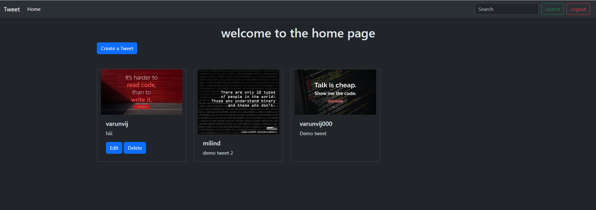
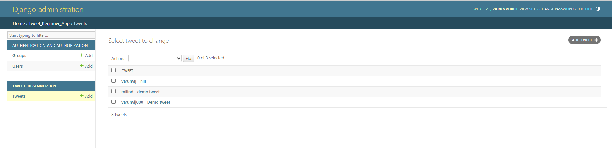

# Demo Full-Stack Application with Django and REST framework

## Overview
This project showcases a full-stack application built using Django and Django REST framework. Key features include user authentication, CRUD operations on tweets, and handling of images and text. The application utilizes Django's ORM and Django REST framework to create a robust RESTful API for tweet management.




## Technologies Used
- **Backend**: Django, Django REST framework
- **Frontend**: HTML, minimal CSS, BootStrap
- **Database**: SQLite (default with Django)

## Features Implemented
### User Authentication:
- Users can register and log in.
- Basic form validation and password hashing.

### Tweet Management:
- CRUD operations on tweets (Create, Read, Update, Delete).
- Tweets stored with associated user information using Django's ORM.

### Image and Text Manipulation:
- Upload images along with tweets.
- Basic text manipulation (e.g., filtering, basic HTML handling).

### Responsive Design:
- Minimal CSS for basic responsiveness.

## How to Run the Project
### Prerequisites
- Python 3.x installed locally
- Git installed locally
- Basic understanding of Django and Django REST framework

### Steps to Run
1. Clone the repository:
   ```bash
   git clone https://github.com/Varunv003/django_app
   cd django_app

2. Setup Virtual Environment (Optional but recommended):
   ```bash
   python -m venv venv
   source venv/bin/activate  # On Windows use `venv\Scripts\activate`

3. Install dependencies:
   ```bash
   pip install -r requirements.txt

4. Apply migrations::
   ```bash
   python manage.py migrate

5. Create a superuser (for admin access):
   ```bash
   python manage.py createsuperuser

6. Run the development server:
   ```bash
   python manage.py runserver

7. Run the development server:
   Open your web browser and go to http://localhost:8000/


